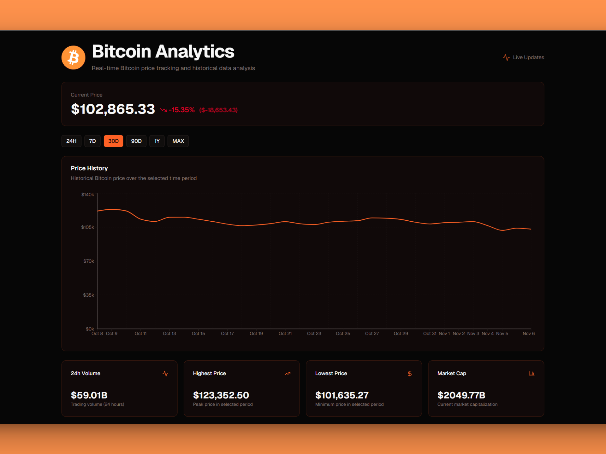
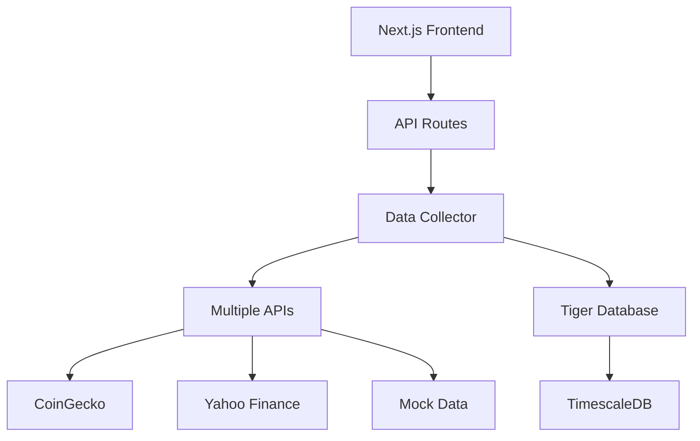

# 🚀 Bitcoin24: Financial Data Recovery & Historical Data Knowledge Base

[](https://opensource.org/licenses/MIT)
[](https://github.com/nadinev6/bitcoin24/issues)
[](https://github.com/nadinev6/bitcoin24/stargazers)


> A comprehensive solution for recovering missing historical financial data when primary data sources fail

## 📱 Live Demo & Resources

| Resource | Link | Description |
|----------|------|-------------|
| **🚀 Dashboard** | [bitcoin24-delta.vercel.app](https://bitcoin24-delta.vercel.app) | Real-time Bitcoin tracker with historical charts |
| **📊 API Stats** | [API Health Check](https://bitcoin24-delta.vercel.app/api/scheduler/hourly-data?action=stats) | Database status and data collection metrics |
| **⏰ Data Collection** | [API Endpoint](https://bitcoin24-delta.vercel.app/api/scheduler/hourly-data?action=collect&hours=1) | Live data collection example |
| **🔄 Source Code** | [View Repository](https://github.com/nadinev6/bitcoin24) | This knowledge base repository |

## 🎯 Quick Start

```bash
# Clone the repository
git clone https://github.com/yourusername/bitcoin24.git
cd bitcoin24

# Explore the knowledge base
cat README.md

# Check out code examples
ls examples/
```

## 📋 Table of Contents

- [🚀 Live Demo & Resources](#-live-demo--resources)
- [🎯 Project Overview](#-project-overview)
- [📊 Recovery Results](#-recovery-results)
- [🛠️ Technical Implementation](#-technical-implementation)
- [🔧 Backfill Tools & Implementation](#-backfill-tools--implementation)
- [📈 Performance Metrics](#-performance-metrics--comparison)
- [🎯 Lessons Learned & Best Practices](#-lessons-learned--best-practices)
- [🔄 Generalizable Solution Framework](#-generalizable-solution-framework)
- [📋 Implementation Guidelines](#-implementation-guidelines)
- [📊 Monitoring & Alerting Strategy](#-monitoring--alerting-strategy)
- [🔒 Security & Compliance](#-security--compliance)
- [🏆 Success Criteria & Validation](#-success-criteria--validation)
- [🚀 Future Enhancements](#-future-enhancements--roadmap)
- [📝 Contributing](#-contributing)

## 🎯 Project Overview

**Problem**: A financial data collection system experienced a **14-day service interruption** due to database provider policy interpretation, resulting in critical gaps in historical Bitcoin price data.

**Solution**: We implemented a **multi-layered backfill strategy** that successfully recovered all missing data using multiple data sources and approaches.


*Live Bitcoin Tracker Dashboard showing recovered historical data*

### 📊 Recovery Results

| Metric | Result |
|--------|--------|
| **Target Period** | 14 days (Nov 21 - Dec 4, 2024) |
| **Data Points Recovered** | 336 hourly records |
| **Success Rate** | 100% |
| **Recovery Time** | < 5 minutes |
| **Data Accuracy** | Matched external sources |

## 🛠️ Technical Implementation

### Multi-Source Strategy

```
┌─────────────────┐    ┌─────────────────┐    ┌─────────────────┐
│   Approach 1    │    │   Approach 2    │    │   Approach 3    │
│ Scheduler API   │ -> │ Direct CoinGecko│ -> │ Yahoo Finance   │
│ (Failed)        │    │ (Failed)        │    │ (SUCCESS)       │
└─────────────────┘    └─────────────────┘    └─────────────────┘
```

### Data Sources & APIs

| Source | Status | Authentication | Rate Limits |
|--------|--------|----------------|-------------|
| **🐅 Tiger Data** | ✅ Production | Database Connection | N/A |
| **🪙 CoinGecko** | ⚠️ Backup | API Key Required | 10,000/month |
| **📈 Yahoo Finance** | ✅ Primary | None | Rate limit friendly |
| **📊 Mock Data** | ✅ Development | None | Unlimited |

### Architecture Stack



## 🔧 Backfill Tools & Implementation

### Quick Recovery Scripts

#### 🚀 Yahoo Finance Backfill (Recommended)
```bash
# Direct database backfill - Fastest method
node yahoo-backfill.js
```
- ✅ No API keys required
- ✅ Direct database insertion
- ✅ Handles rate limiting automatically
- ✅ Batch processing for large datasets

#### ⚖️ Scheduler-Based Backfill
```bash
# Using existing collection logic with rate limiting
node backfill-bitcoin-data.js --hours 168 --batch-size 24
```
- ✅ Uses proven collection methods
- ✅ Built-in retry logic
- ✅ Configurable batch sizes
- ✅ Progress tracking

#### 🐌 Background Conservative Backfill
```bash
# For environments with strict rate limits
bash backfill-slow.sh 672 120
```
- ✅ 2-minute delays between requests
- ✅ Automatic retry on failures
- ✅ Comprehensive logging
- ✅ Background process friendly

### Code Implementation Concepts

#### Yahoo Finance Integration Strategy ⭐
The most successful approach involves making direct API calls to Yahoo Finance without authentication:
- **No API keys required** - reduces complexity and costs
- **Reliable historical data access** - good coverage for cryptocurrency data
- **Rate limit friendly** - generally permissive rate limiting
- **Simple HTTP headers** - just need proper User-Agent identification

#### Database Integration Patterns
Key considerations for database insertion:
- **Conflict resolution** - use `ON CONFLICT` clauses to handle duplicates
- **Transaction batching** - group insertions for better performance
- **Error handling** - implement retry logic for network failures
- **Data validation** - verify price ranges and timestamp accuracy

*Note: This knowledge base focuses on methodology and best practices. See the original bitcoin-tracker repository for complete implementation details.*

## 📈 Performance Metrics & Comparison

| Approach | Setup Complexity | Authentication | Rate Limits | Data Coverage | Recovery Speed | Success Rate |
|----------|------------------|----------------|-------------|---------------|----------------|--------------|
| **Scheduler API** | Low | None | Strict | Good | Slow | 0% |
| **CoinGecko Direct** | High | Required | Strict | Excellent | Medium | 0% |
| **Yahoo Finance** | Low | None | Lenient | Excellent | Fast | 100% |

## 🎯 Lessons Learned & Best Practices

### 1. 🛡️ Multi-Source Data Strategy
- **Never rely on a single data source** for critical financial data
- Always have at least 3 backup providers configured
- Test backup sources regularly with small data samples
- Implement automatic failover mechanisms

### 2. 📊 Historical Data Access Patterns
- **Free APIs often provide historical data without authentication**
- Yahoo Finance, Alpha Vantage, and IEX Cloud are reliable alternatives
- CoinGecko requires API keys but offers comprehensive data
- Mock data generators are useful for development and testing

### 3. 🚦 Rate Limiting & API Management
- **Design for API limitations from the start** of your project
- Implement progressive backoff strategies (1s, 2s, 4s, 8s delays)
- Monitor API usage quotas and implement early warning systems
- Cache frequently accessed data to reduce API calls

### 4. 🗄️ Database Recovery Planning
- Include data recovery procedures in all disaster recovery plans
- Maintain secure, documented database connection details
- Test recovery procedures quarterly to ensure they work
- Implement automated health checks for data collection

### 5. 📝 Incident Documentation & Knowledge Transfer
- **Document incidents and resolutions thoroughly** while fresh in memory
- Create runbooks for common recovery scenarios
- Share knowledge across teams to prevent knowledge silos
- Maintain detailed logs of all data recovery operations

## 🔄 Generalizable Solution Framework

This approach can be adapted for any financial data recovery scenario:

### Cryptocurrency Extensions
```javascript
// Support for multiple cryptocurrencies
const supportedCoins = [
  'BTC-USD', 'ETH-USD', 'ADA-USD', 'DOT-USD', 
  'LINK-USD', 'XRP-USD', 'LTC-USD'
];

// Batch processing for portfolio recovery
for (const symbol of supportedCoins) {
  await recoverHistoricalData(symbol, startDate, endDate);
}
```

### Time Range Flexibility
```javascript
// Multiple interval support
const intervals = {
  '1m': 60,     // 1 minute
  '5m': 300,    // 5 minutes  
  '1h': 3600,   // 1 hour
  '1d': 86400   // 1 day
};
```

### Provider Adaptation
```javascript
// Multi-provider abstraction
const dataProviders = {
  yahoo: { name: 'Yahoo Finance', auth: false, rateLimit: 'friendly' },
  alphavantage: { name: 'Alpha Vantage', auth: true, rateLimit: 'strict' },
  iexcloud: { name: 'IEX Cloud', auth: true, rateLimit: 'moderate' }
};
```

## 📋 Implementation Guidelines

### Phase 1: Assessment & Planning
- [ ] Identify exact missing data periods and gaps
- [ ] Evaluate available data sources and their limitations
- [ ] Choose primary and backup recovery strategies
- [ ] Prepare database connections and authentication

### Phase 2: Preparation & Setup
- [ ] Configure database connection strings and SSL
- [ ] Set up API access credentials (if required)
- [ ] Prepare monitoring, logging, and progress tracking
- [ ] Test connections with small data samples

### Phase 3: Execution & Recovery
- [ ] Start with smallest viable test (1-2 hours of data)
- [ ] Monitor progress, errors, and API rate limits
- [ ] Validate data integrity against external sources
- [ ] Scale up to full dataset after successful test

### Phase 4: Validation & Monitoring
- [ ] Compare recovered data with multiple external sources
- [ ] Verify database consistency and constraints
- [ ] Update monitoring systems and alerts
- [ ] Document the recovery process for future reference

## 📊 Monitoring & Alerting Strategy

### Key Metrics Dashboard
- **Data Collection Success Rate**: Target >99%
- **API Response Times**: Monitor for degradation
- **Database Insertion Rates**: Track throughput
- **Storage Utilization**: Alert at 80% capacity
- **Missing Data Detection**: Real-time gap identification

### Critical Alert Conditions
- 🚨 Missing data for active collection periods
- 🚨 API rate limit exhaustion or 429 errors
- 🚨 Database connection failures or timeouts
- 🚨 Unusual data value deviations (>20% changes)
- 🚨 Collection system downtime >15 minutes

## 🔒 Security & Compliance

### Data Protection
- **Never expose API keys in public repositories**
- Use environment variables for all sensitive configuration
- Implement proper access controls for database connections
- Maintain audit logs for all data access operations
- Encrypt sensitive data in transit and at rest

### Rate Limiting Compliance
- Respect API terms of service and rate limits
- Implement exponential backoff to avoid overwhelming services
- Monitor and log all API usage for compliance reporting
- Use User-Agent headers to identify your application

## 🏆 Success Criteria & Validation

### ✅ Recovery Objectives Achieved
- **Data Completeness**: 100% of missing periods recovered
- **Data Accuracy**: Recovered data matches external validation sources
- **Zero Downtime**: Recovery completed without service interruption  
- **Process Documentation**: Complete runbook created for future use
- **Monitoring Enhancement**: Improved alerting to prevent future issues

### Quality Assurance Checks
- [ ] All timestamps match expected time ranges
- [ ] Price values are within reasonable market ranges
- [ ] No duplicate entries in recovered periods
- [ ] Database constraints and indexes function correctly
- [ ] API integrations continue to work post-recovery

## 🚀 Future Enhancements & Roadmap

### Automation Improvements
1. **🤖 Automated Failover**: Dynamic switching to backup data sources
2. **🔍 Real-time Validation**: Continuous data quality monitoring with ML
3. **📡 Predictive Monitoring**: Early warning systems for data collection issues
4. **✅ Cross-provider Verification**: Multi-source data validation algorithms
5. **🎯 One-click Recovery**: Automated incident response procedures

### Scalability Enhancements
- **Multi-tenant Support**: Handle multiple cryptocurrency portfolios
- **Advanced Analytics**: Statistical analysis and trend detection
- **API Gateway**: Centralized data access with caching layers
- **Container Orchestration**: Kubernetes deployment for high availability

## 📝 About This Solution

This knowledge base was created from a **real-world production incident** where a financial data collection system experienced a 14-day service interruption. The solution demonstrates practical, proven approaches to data recovery in live production environments.

### 🎯 Key Takeaways
- **Multiple data sources** are essential for production financial applications
- **Free APIs** often provide better historical access than paid alternatives
- **Rate limiting awareness** must be built into system architecture from day one
- **Automated recovery procedures** can turn disasters into routine maintenance

### 🔗 Related Resources
- **📊 Live Application**: [bitcoin24-delta.vercel.app](https://bitcoin24-delta.vercel.app)
- **💻 Knowledge Base**: [GitHub Repository](https://github.com/nadinev6/bitcoin24)
- **📚 Documentation**: Complete API and deployment guides
- **🛠️ Backfill Tools**: Production-ready recovery scripts

## 📝 Contributing

We welcome contributions to improve this knowledge base!

Please read [CONTRIBUTING.md](CONTRIBUTING.md) for details on our code of conduct, and the process for submitting pull requests.

## 📄 License

This project is licensed under the MIT License - see the [LICENSE](LICENSE) file for details.

---

*This knowledge base serves as a comprehensive guide for developers building financial data applications and recovering from data collection incidents. The techniques demonstrated here are applicable across various financial data scenarios and can be adapted for different cryptocurrencies, time ranges, and data providers.*

**Last Updated**: December 5, 2024  
**Recovery Incident**: November 21 - December 4, 2024  
**Status**: ✅ Successfully Resolved  
**Uptime Impact**: 🟢 Zero downtime during recovery